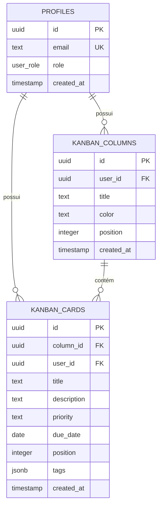

# Modelagem de Banco de Dados (Models Guide)

Este documento mapeia e descreve com detalhes toda a estrutura do banco de dados (esquema físico, tabelas, relacionamentos, enums e políticas de RLS) utilizado pelo **Suri Tools**.

---

## 🗺️ Modelo Entidade-Relacionamento (ERD)



---

## 🗂️ Definição das Tabelas

### 1. Perfil de Usuários (`profiles`)
Esta tabela complementa a autenticação nativa do Supabase (ou gerencia os dados cadastrais localmente em desenvolvimento).

*   **Nome físico**: `profiles`
*   **Campos**:

| Nome da Coluna | Tipo SQL | Chave | Default / Constraints | Descrição |
| :--- | :--- | :---: | :--- | :--- |
| `id` | `UUID` | **PK** | `uuid_generate_v4()` | Identificador único do usuário / perfil. |
| `email` | `TEXT` | **UK** | `NOT NULL`, `UNIQUE` | E-mail corporativo ou de acesso do usuário. |
| `role` | `user_role` | - | `'user'` | Nível de privilégio de acesso (Enum). |
| `created_at` | `TIMESTAMPTZ` | - | `CURRENT_TIMESTAMP` | Data e hora de cadastro do usuário. |

---

### 2. Colunas do Kanban (`kanban_columns`)
Representa as colunas verticais do painel de tarefas de cada usuário (ex: "A Fazer", "Em Andamento").

*   **Nome físico**: `kanban_columns`
*   **Campos**:

| Nome da Coluna | Tipo SQL | Chave | Default / Constraints | Descrição |
| :--- | :--- | :---: | :--- | :--- |
| `id` | `UUID` | **PK** | `uuid_generate_v4()` | Identificador único da coluna. |
| `user_id` | `UUID` | **FK** | `REFERENCES profiles(id) ON DELETE CASCADE` | Usuário proprietário da coluna. |
| `title` | `TEXT` | - | `NOT NULL` | Título legível da coluna (ex: "Backlog"). |
| `color` | `TEXT` | - | `'#9ca3af'` | Cor hexadecimal da borda/indicador da coluna. |
| `position` | `INTEGER` | - | `0` | Posição sequencial na ordenação horizontal. |
| `created_at` | `TIMESTAMPTZ` | - | `CURRENT_TIMESTAMP` | Data e hora de criação da coluna. |

---

### 3. Cards do Kanban (`kanban_cards`)
Armazena as tarefas individuais criadas dentro de cada coluna do painel de Kanban.

*   **Nome físico**: `kanban_cards`
*   **Campos**:

| Nome da Coluna | Tipo SQL | Chave | Default / Constraints | Descrição |
| :--- | :--- | :---: | :--- | :--- |
| `id` | `UUID` | **PK** | `uuid_generate_v4()` | Identificador único da tarefa (Card). |
| `column_id` | `UUID` | **FK** | `REFERENCES kanban_columns(id) ON DELETE CASCADE` | Coluna onde a tarefa reside. |
| `user_id` | `UUID` | **FK** | `REFERENCES profiles(id) ON DELETE CASCADE` | Usuário responsável pela tarefa. |
| `title` | `TEXT` | - | `NOT NULL` | Título ou descrição sucinta da tarefa. |
| `description` | `TEXT` | - | `NULL` | Descrição detalhada da atividade. |
| `priority` | `TEXT` | - | `'MÉDIO'` | Nível de prioridade (`BAIXO`, `MÉDIO`, `ALTO`, `URGENTE`). |
| `due_date` | `DATE` | - | `NULL` | Prazo limite para entrega da tarefa. |
| `position` | `INTEGER` | - | `0` | Posição sequencial na ordenação vertical. |
| `tags` | `JSONB` | - | `'[]'::jsonb` | Tags ou marcadores associados à tarefa (ex: `["Bug", "Frontend"]`). |
| `created_at` | `TIMESTAMPTZ` | - | `CURRENT_TIMESTAMP` | Data e hora de criação do card. |

---

## ⚙️ Tipos customizados (Enums)

### `user_role`
Representa os papéis administrativos suportados no sistema.
- `'user'`: Usuário padrão com acesso restrito a suas próprias tarefas e cálculos.
- `'admin'`: Acesso completo incluindo painéis de administração de usuários.

---

## 🔒 Segurança (Row Level Security - RLS)

Para o ambiente de produção rodando sob o **Supabase**, é obrigatório habilitar políticas de segurança RLS nas tabelas para que nenhum usuário tenha visibilidade ou permissão de escrita sobre dados de terceiros:

```sql
-- Segurança de Perfis
ALTER TABLE profiles ENABLE ROW LEVEL SECURITY;

CREATE POLICY "Users can view their own profile" 
ON profiles FOR SELECT 
USING (auth.uid() = id);

-- Segurança de Colunas do Kanban
ALTER TABLE kanban_columns ENABLE ROW LEVEL SECURITY;

CREATE POLICY "Users can manage their own columns" 
ON kanban_columns FOR ALL 
USING (auth.uid() = user_id);

-- Segurança de Cards do Kanban
ALTER TABLE kanban_cards ENABLE ROW LEVEL SECURITY;

CREATE POLICY "Users can manage their own cards" 
ON kanban_cards FOR ALL 
USING (auth.uid() = user_id);
```
