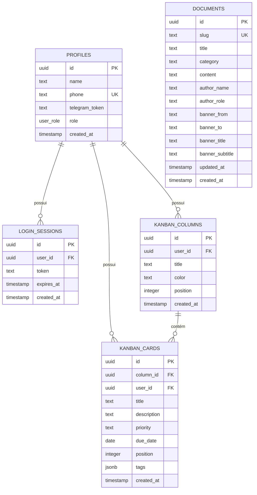

# Modelagem de Banco de Dados (Models Guide)

Este documento mapeia e descreve com detalhes toda a estrutura do banco de dados (esquema físico, tabelas, relacionamentos, enums e políticas de RLS) utilizado pelo **Suri Tools**.

---

## 🗺️ Modelo Entidade-Relacionamento (ERD)



---

## 🗂️ Definição das Tabelas

### 1. Perfil de Usuários (`profiles`)
Esta tabela complementa a autenticação nativa do Telegram/Supabase para gerenciar os dados cadastrais dos membros da equipe.

*   **Nome físico**: `profiles`
*   **Campos**:

| Nome da Coluna | Tipo SQL | Chave | Default / Constraints | Descrição |
| :--- | :--- | :---: | :--- | :--- |
| `id` | `UUID` | **PK** | `uuid_generate_v4()` | Identificador único do usuário / perfil. |
| `name` | `TEXT` | - | `NOT NULL` | Nome completo de exibição do usuário. |
| `phone` | `TEXT` | **UK** | `NOT NULL`, `UNIQUE` | Telefone celular real do usuário. |
| `telegram_token` | `TEXT` | - | `NULL` | Token ou Chat ID do Telegram para entrega de OTP. |
| `role` | `user_role` | - | `'user'` | Nível de privilégio de acesso (Enum). |
| `created_at` | `TIMESTAMPTZ` | - | `CURRENT_TIMESTAMP` | Data e hora de cadastro do usuário. |

---

### 2. Sessões de Login (`login_sessions`)
Gerencia os tokens de sessões seguras gerados para manter o login dos usuários ativo no navegador por 7 dias.

*   **Nome físico**: `login_sessions`
*   **Campos**:

| Nome da Coluna | Tipo SQL | Chave | Default / Constraints | Descrição |
| :--- | :--- | :---: | :--- | :--- |
| `id` | `UUID` | **PK** | `uuid_generate_v4()` | Identificador único da sessão. |
| `user_id` | `UUID` | **FK** | `REFERENCES profiles(id) ON DELETE CASCADE` | ID do perfil proprietário da sessão. |
| `token` | `TEXT` | - | `NOT NULL` | Token criptográfico de login único gerado. |
| `expires_at` | `TIMESTAMPTZ` | - | `NOT NULL` | Data e hora limite de validade da sessão. |
| `created_at` | `TIMESTAMPTZ` | - | `CURRENT_TIMESTAMP` | Data e hora de início da sessão. |

---

### 3. Colunas do Kanban (`kanban_columns`)
Representa as colunas verticais do painel de tarefas de cada usuário (ex: "A Fazer", "Em Andamento").

*   **Nome físico**: `kanban_columns`
*   **Campos**:

| Nome da Coluna | Tipo SQL | Chave | Default / Constraints | Descrição |
| :--- | :--- | :---: | :--- | :--- |
| `id` | `UUID` | **PK** | `uuid_generate_v4()` | Identificador único da coluna. |
| `user_id` | `UUID` | **FK** | `REFERENCES profiles(id) ON DELETE CASCADE` | Usuário proprietário da coluna. |
| `title` | `TEXT` | - | `NOT NULL` | Título legível da coluna (ex: "Backlog"). |
| `color` | `TEXT` | - | `'#9ca3af'` | Cor hexadecimal da borda/indicador da coluna. |
| `position` | `INTEGER` | - | `0` | Posição sequencial na ordenação horizontal. |
| `created_at` | `TIMESTAMPTZ` | - | `CURRENT_TIMESTAMP` | Data e hora de criação da coluna. |

---

### 4. Cards do Kanban (`kanban_cards`)
Armazena as tarefas individuais criadas dentro de cada coluna do painel de Kanban.

*   **Nome físico**: `kanban_cards`
*   **Campos**:

| Nome da Coluna | Tipo SQL | Chave | Default / Constraints | Descrição |
| :--- | :--- | :---: | :--- | :--- |
| `id` | `UUID` | **PK** | `uuid_generate_v4()` | Identificador único da tarefa (Card). |
| `column_id` | `UUID` | **FK** | `REFERENCES kanban_columns(id) ON DELETE CASCADE` | Coluna onde a tarefa reside. |
| `user_id` | `UUID` | **FK** | `REFERENCES profiles(id) ON DELETE CASCADE` | Usuário responsável pela tarefa. |
| `title` | `TEXT` | - | `NOT NULL` | Título ou descrição sucinta da tarefa. |
| `description` | `TEXT` | - | `NULL` | Descrição detalhada da atividade. |
| `priority` | `TEXT` | - | `'MÉDIO'` | Nível de prioridade (`BAIXO`, `MÉDIO`, `ALTO`, `URGENTE`). |
| `due_date` | `DATE` | - | `NULL` | Prazo limite para entrega da tarefa. |
| `position` | `INTEGER` | - | `0` | Posição sequencial na ordenação vertical. |
| `tags` | `JSONB` | - | `'[]'::jsonb` | Tags associadas à tarefa (ex: `["Bug", "Frontend"]`). |
| `created_at` | `TIMESTAMPTZ` | - | `CURRENT_TIMESTAMP` | Data e hora de criação do card. |

---

### 5. Artigos de Documentação (`documents`)
Armazena as páginas, artigos e guias de suporte da plataforma editados dinamicamente via painel administrativo.

*   **Nome físico**: `documents`
*   **Campos**:

| Nome da Coluna | Tipo SQL | Chave | Default / Constraints | Descrição |
| :--- | :--- | :---: | :--- | :--- |
| `id` | `UUID` | **PK** | `uuid_generate_v4()` | Identificador único do documento. |
| `slug` | `TEXT` | **UK** | `NOT NULL`, `UNIQUE` | URL amigável identificadora da página (ex: `'bem-vindo'`). |
| `title` | `TEXT` | - | `NOT NULL` | Título visível no cabeçalho do artigo. |
| `category` | `TEXT` | - | `NOT NULL` | Categoria de agrupamento (ex: `'Introdução'`, `'Módulos'`). |
| `content` | `TEXT` | - | `NOT NULL` | Corpo do documento em formato Markdown nativo. |
| `author_name` | `TEXT` | - | `NULL` | Nome do desenvolvedor autor do artigo. |
| `author_role` | `TEXT` | - | `NULL` | Cargo ou papel profissional do autor. |
| `banner_from` | `TEXT` | - | `NULL` | Cor de início (hexadecimal) do gradiente do banner. |
| `banner_to` | `TEXT` | - | `NULL` | Cor de término (hexadecimal) do gradiente do banner. |
| `banner_title` | `TEXT` | - | `NULL` | Título destacado no centro do banner. |
| `banner_subtitle`| `TEXT` | - | `NULL` | Subtítulo do banner. |
| `updated_at` | `TIMESTAMPTZ` | - | `CURRENT_TIMESTAMP` | Data e hora da última alteração de conteúdo. |
| `created_at` | `TIMESTAMPTZ` | - | `CURRENT_TIMESTAMP` | Data de criação original do registro. |

---

## ⚙️ Tipos customizados (Enums)

### `user_role`
Representa os papéis administrativos suportados no sistema.
- `'user'`: Usuário padrão com acesso restrito a suas próprias tarefas, documentações e cálculos.
- `'admin'`: Acesso completo incluindo painéis de administração de usuários, criação e edição de artigos de documentação e Kanban global do time.

---

## 🔒 Segurança (Row Level Security - RLS)

No ambiente Supabase em produção, habilitamos políticas restritas de segurança (RLS) para garantir o isolamento total dos dados sensíveis por usuário:

```sql
-- Segurança de Perfis
ALTER TABLE profiles ENABLE ROW LEVEL SECURITY;

CREATE POLICY "Qualquer um pode ler perfis públicos" 
ON profiles FOR SELECT USING (true);

CREATE POLICY "Usuários modificam seu próprio perfil" 
ON profiles FOR UPDATE USING (true);

CREATE POLICY "Qualquer um pode criar perfis" 
ON profiles FOR INSERT WITH CHECK (true);

-- Segurança de Colunas do Kanban
ALTER TABLE kanban_columns ENABLE ROW LEVEL SECURITY;

CREATE POLICY "Users can manage their own columns" 
ON kanban_columns FOR ALL 
USING (true);

-- Segurança de Cards do Kanban
ALTER TABLE kanban_cards ENABLE ROW LEVEL SECURITY;

CREATE POLICY "Users can manage their own cards" 
ON kanban_cards FOR ALL 
USING (true);

-- Segurança de Documentos
ALTER TABLE documents ENABLE ROW LEVEL SECURITY;

CREATE POLICY "Qualquer um lê documentos" 
ON documents FOR SELECT USING (true);

CREATE POLICY "Apenas admins escrevem documentos" 
ON documents FOR ALL USING (
  EXISTS (
    SELECT 1 FROM profiles 
    WHERE profiles.id = auth.uid() AND profiles.role = 'admin'
  )
);
```
